# 🤖 AI Trading Agent

Intelligent trading agent powered by LLM for automated US stock trading with multiple API provider support.

## 🏗️ System Architecture

### Core Components

- **TradingSystem**: Main system orchestrator managing all component lifecycles
- **API Adapters**: Unified interfaces for brokers, market data, news, and other services
- **AI Workflows**: Supports Sequential (fixed steps) and ToolCalling (dynamic decisions) modes
- **Event System**: Real-time processing of orders, portfolio, and trading events
- **Task Scheduler**: Automated execution of daily trading tasks
- **Telegram Bot**: Remote control and real-time notifications

### System Architecture



*Complete system architecture showing all components and their relationships*

### Workflow Process



*Simplified workflow showing the main process flow*

**📊 Documentation Links:**
- **[System Architecture Details](docs/system-architecture.md)** - Detailed component descriptions
- **[Workflow Documentation](docs/workflow-diagram.md)** - Process flow explanations


## 🚀 Quick Start

### 1. Install Dependencies
```bash
pip install -r requirements.txt
```

### 2. Environment Setup
```bash
cp env.template .env
```

Configure `.env` file:
```bash
# API Keys
ALPACA_API_KEY=your_alpaca_key
ALPACA_SECRET_KEY=your_alpaca_secret
TIINGO_API_KEY=your_tiingo_key

# AI Configuration
LLM_PROVIDER=openai  # or deepseek
OPENAI_API_KEY=your_openai_key
WORKFLOW_TYPE=sequential  # or tool_calling

# Telegram Configuration
TELEGRAM_BOT_TOKEN=your_bot_token
TELEGRAM_CHAT_ID=your_chat_id

# Trading Parameters
PAPER_TRADING=true
MAX_POSITION_SIZE=0.1
STOP_LOSS_PERCENTAGE=0.05
TAKE_PROFIT_PERCENTAGE=0.15
```

### 3. Start System
```bash
python main.py
```

## 🤖 AI Workflows

### Sequential Workflow
- **Execution Flow**: Data Collection → Market Analysis → Decision Making → Trade Execution
- **Characteristics**: Predictable, cost-effective, suitable for systematic trading strategies
- **Use Case**: Daily automated trading

### Tool Calling Workflow
- **Execution Method**: LLM dynamically selects tools and execution order
- **Characteristics**: More intelligent, adaptive, higher cost
- **Use Case**: Complex market analysis and decision making

#### Available Tools
- `get_portfolio_info`: Get portfolio information
- `get_market_data`: Fetch market data
- `get_news`: Retrieve news feed
- `get_market_status`: Check market status
- `get_active_orders`: View active orders
- `make_trading_decision`: Make trading decisions

### **🌟 LLM Portfolio Agent** (🆕 推荐)
**完全由LLM驱动的投资组合管理 - 无硬编码规则！**

- **核心理念**: 
  - ❌ **不使用**固定规则（如18%仓位、±3%触发）
  - ✅ **完全由LLM自主决策** - 何时调整、如何配置
  
- **工作方式**:
  - LLM作为ReAct Agent，可使用多个tools
  - 持续分析市场数据、新闻、持仓状况
  - LLM自主判断是否需要rebalance
  - LLM决定目标股票和仓位配置

- **可用Tools**:
  ```
  get_portfolio_status    - 获取组合状态
  get_market_data         - 获取市场数据  
  get_latest_news         - 获取最新新闻
  get_position_analysis   - 分析持仓分布
  get_stock_info          - 获取个股信息
  rebalance_portfolio     - 执行重新平衡
  ```

- **优势**:
  - 🧠 智能灵活 - LLM基于实际情况决策
  - 🔄 自适应 - 无需调整参数，LLM自动适应市场
  - 📊 可解释 - LLM提供决策理由
  - 🎯 精准 - 基于多维度分析（市场、新闻、技术指标）

- **Use Case**: 最智能的组合管理方式，适合希望完全由AI驱动的用户

---

### Balanced Portfolio Workflow (⚠️ 已弃用)
- **Strategy**: Maintain balanced portfolio with ~18% position per stock (5-6 stocks total)
- **Note**: 基于固定规则，推荐使用 `llm_portfolio` 替代

## 📱 Telegram Control

### Basic Commands
- `/start` - Start trading system
- `/stop` - Stop trading system
- `/status` - Check system status
- `/portfolio` - Portfolio overview
- `/analyze` - Manually trigger AI analysis
- `/emergency` - Emergency stop all trading

## ⚙️ Configuration

### Trading Parameters
```bash
PAPER_TRADING=true              # Paper trading mode
MAX_POSITION_SIZE=0.1          # Max position size (10%)
MAX_POSITIONS=10               # Max number of positions
STOP_LOSS_PERCENTAGE=0.05      # Stop loss percentage (5%)
TAKE_PROFIT_PERCENTAGE=0.15    # Take profit percentage (15%)
REBALANCE_TIME=09:30           # Daily rebalancing time
```

### AI Model Configuration
```bash
LLM_PROVIDER=openai                    # AI provider: openai or deepseek
OPENAI_MODEL=gpt-4o                   # OpenAI model
DEEPSEEK_MODEL=deepseek-chat          # DeepSeek model
WORKFLOW_TYPE=llm_portfolio           # 🌟 推荐: llm_portfolio (完全LLM驱动)
                                       # 其他选项: sequential, tool_calling, balanced_portfolio
```

### API Providers
```bash
BROKER_PROVIDER=alpaca          # Broker: alpaca
MARKET_DATA_PROVIDER=tiingo     # Market data: tiingo
NEWS_PROVIDER=tiingo            # News: tiingo
MESSAGE_PROVIDER=telegram       # Messaging: telegram
```

## 🏗️ Project Structure

```
src/
├── adapters/                   # API Adapters
│   ├── brokers/
│   │   └── alpaca_adapter.py           # Alpaca broker interface
│   ├── market_data/
│   │   ├── tiingo_market_data_adapter.py      # Tiingo REST API
│   │   └── 🆕 tiingo_websocket_adapter.py     # Tiingo WebSocket (real-time data)
│   ├── news/
│   │   └── tiingo_news_adapter.py             # Tiingo news
│   └── transports/
│       └── telegram_service.py                # Telegram service
├── interfaces/                 # Abstract Interfaces
│   ├── broker_api.py               # Broker interface definition
│   ├── market_data_api.py          # Market data interface
│   ├── news_api.py                 # News interface
│   ├── message_transport.py        # Message transport interface
│   └── factory.py                  # Service creation
├── agents/                     # AI Workflows
│   ├── workflow_factory.py         # Workflow creation
│   ├── workflow_base.py            # Base class
│   ├── sequential_workflow.py      # Sequential workflow
│   ├── tool_calling_workflow.py    # Tool calling workflow
│   └── 🆕 balanced_portfolio_workflow.py  # Balanced portfolio strategy
├── 🆕 services/                    # Background Services
│   └── realtime_monitor.py         # Real-time market monitoring
├── events/
│   └── event_system.py             # Event system
├── messaging/
│   └── message_manager.py          # Message management
├── scheduler/
│   └── trading_scheduler.py        # Task scheduling (🔧 bug fixed)
├── models/
│   └── trading_models.py           # Data models
├── utils/                      # Utility functions
│   ├── string_utils.py        
│   ├── telegram_utils.py      
│   └── message_formatters.py  
└── trading_system.py           # Main system (🔧 enhanced)
```

## 🧪 Testing

```bash
# Run all tests
python run_tests.py

# Run specific tests
pytest tests/test_workflow_factory.py -v
pytest tests/test_alpaca_api.py -v
```

## 📊 System Features

### Automated Trading
- **AI Decision Making**: Intelligent analysis based on market data and news
- **Risk Control**: Automatic stop-loss and take-profit mechanisms
- **Position Management**: Smart position allocation and rebalancing
- **🆕 Real-time Monitoring**: Live market data streaming via Tiingo WebSocket
- **🆕 Event-driven Rebalancing**: Auto-trigger on price changes, volatility, and breaking news
- **🆕 Balanced Portfolio Strategy**: Maintain 5-6 positions with ~18% each for optimal diversification

### Remote Control
- **Telegram Integration**: Control trading system anytime, anywhere
- **Real-time Notifications**: Instant notifications for trades, system status
- **Command Control**: Complete control with start, stop, query commands

### Security
- **Paper Trading**: Enabled by default, zero-risk testing
- **Multi-layer Security**: API keys, permissions, and access controls
- **Emergency Stop**: One-click position closure for capital protection

## 🔒 Risk Management

- **Paper Trading**: Enabled by default, safe testing environment
- **Position Limits**: Maximum 10% per position, total position control
- **Stop Loss**: Automatic 5% stop-loss protection
- **Take Profit**: Automatic 15% take-profit to lock in gains
- **Emergency Controls**: One-click liquidation and emergency stop

## 📄 License

MIT License

## 🆕 Recent Updates

### Version 2.1 - LLM-Driven Portfolio Management (Latest)

#### 🌟 核心改进：完全LLM驱动，零硬编码规则

之前的 `balanced_portfolio` 使用固定规则（18%仓位、±3%触发等）。
现在的 `llm_portfolio` **完全由LLM自主决策**！

**新设计理念**：
```python
# ❌ 旧方式 (Rule-Based)
if position_drift > 3%:
    rebalance_to_18_percent()

# ✅ 新方式 (LLM-Driven)  
llm.analyze({
    tools: [get_portfolio, get_news, get_market_data, rebalance],
    task: "分析并决定是否需要调整组合"
})
# LLM自己决定：
# - 是否需要调整
# - 调整多少仓位
# - 选择哪些股票
# - 何时执行
```

**关键特性**：
- ✅ **无规则约束** - LLM完全自由决策
- ✅ **多工具支持** - LLM可调用6个tools获取信息和执行操作
- ✅ **ReAct Agent** - LLM推理→执行→观察→再推理的循环
- ✅ **实时响应** - 结合WebSocket实时数据
- ✅ **可解释** - LLM提供决策理由

**使用方式**：
```bash
# .env配置
WORKFLOW_TYPE=llm_portfolio

# 就这么简单！系统将：
# 1. LLM持续分析市场、新闻、组合
# 2. LLM自主决定是否rebalance
# 3. LLM决定目标配置
# 4. 自动执行并监控
```

---

### Version 2.0 - Enhanced Trading System

#### 1. **Balanced Portfolio Workflow**
   - New intelligent portfolio management strategy
   - Maintains 5-6 positions with ~18% allocation each
   - LLM-driven stock selection based on market analysis
   - Automatic rebalancing on multiple triggers

#### 2. **Real-time Market Monitoring**
   - Integrated Tiingo WebSocket for live data streaming
   - Real-time price tracking and volatility detection
   - Event-driven rebalancing on:
     - Price changes (±5%)
     - High volatility (±8%)
     - Breaking news events
   - Smart cooldown period to prevent overtrading

#### 3. **System Improvements**
   - **Fixed**: Scheduler asyncio threading bug
   - **Enhanced**: Event system for better performance
   - **Added**: Real-time monitoring service
   - **Improved**: System status reporting

#### 4. **Code Architecture**
   - Clear separation of concerns
   - Zero redundancy in codebase
   - Modular design for easy maintenance
   - Well-documented components

### Usage Example - LLM Portfolio Agent

```python
# In .env file
WORKFLOW_TYPE=llm_portfolio

# 就这么简单！系统将：
# 1. LLM作为ReAct Agent运行
# 2. LLM使用tools分析市场、新闻、组合
# 3. LLM自主决定是否需要rebalance
# 4. LLM决定目标配置（无固定规则）
# 5. 实时WebSocket监控触发LLM分析
# 6. 完全自动化、智能化
```

### Configuration Options

```bash
# Workflow Selection (推荐)
WORKFLOW_TYPE=llm_portfolio       # 🌟 完全LLM驱动，无规则约束

# Other Options
WORKFLOW_TYPE=sequential          # 固定步骤工作流
WORKFLOW_TYPE=tool_calling        # 动态工具调用
WORKFLOW_TYPE=balanced_portfolio  # ⚠️ 已弃用（基于规则）

# LLM Portfolio Agent 无需额外参数配置
# LLM会自主决定所有策略参数
```

## ⚠️ Disclaimer

This software is for educational purposes only. Trading involves significant risk and may result in financial loss. Past performance does not guarantee future results. Use with caution. 