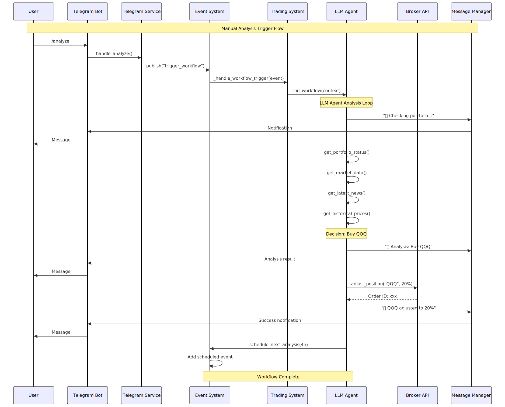

# 🤖 LLM Agent Trading System

**AI-Powered Autonomous Trading System for US Stocks & ETFs**

A fully event-driven, LLM-powered trading system that makes intelligent investment decisions with zero hardcoded rules. Built for high Sharpe ratio (target: 3+) through adaptive portfolio management.

[](https://www.python.org/downloads/)
[](https://opensource.org/licenses/MIT)
[](https://github.com/psf/black)

---

## 🌟 Key Features

### 🧠 **100% LLM-Driven Decision Making**
- **Zero Hardcoded Rules** - LLM makes all trading decisions autonomously
- **Intelligent Tools** - From market data to position adjustment
- **ReAct Agent Architecture** - Think → Act → Observe → Repeat
- **Self-Scheduling** - LLM decides when to analyze next

### 📡 **Event-Driven Architecture**
- **Unified Event System** - All operations triggered by events
- **Real-time Processing** - Async event queue with priority support
- **Fully Decoupled** - Components communicate only via events
- **Scalable Design** - Easy to add new event handlers

### 🎯 **Intelligent Trading Strategies**
- **Adaptive Portfolio Management** - LLM adjusts based on market conditions
- **Multi-dimensional Analysis** - Market data + news + technical indicators
- **Risk-Aware** - Focus on momentum, avoid penny stocks, strict position sizing
- **Long/Short Flexibility** - Support for leveraged and inverse ETFs

### 🔒 **Production-Ready**
- **Paper Trading** - Safe testing environment
- **Risk Management** - Automatic position limits and thresholds
- **Telegram Control** - Remote monitoring and command execution
- **Comprehensive Logging** - Full audit trail of all decisions

---

## 🏗️ System Architecture

### High-Level Overview



*Complete system architecture showing all components and their relationships*

### LLM Agent Tools



*The 11 intelligent tools available to the LLM agent for autonomous decision making*

### Event Flow



*Sequence diagram showing how events flow through the system during a manual analysis*

### System State Machine



*State transitions of the trading system (Initializing → Running → Trading/Paused → Emergency → Stopped)*

---


### Core Components

#### 🎮 **Trading System**
- Central orchestrator managing all components
- Event-driven lifecycle management
- System start/stop and trading enable/disable control
- Status monitoring and reporting

#### 📬 **Event System**
- **Unified event publishing** via single `publish()` method
- **Priority queue** for urgent events (emergency stop, etc.)
- **Scheduled events** for time-based triggers
- **Event types**: `trigger_workflow`, `enable_trading`, `disable_trading`, `query_status`, etc.

#### 🤖 **LLM Portfolio Agent**
- **11 intelligent tools** for market analysis and trading
- **Fully autonomous** - makes all decisions independently
- **Self-aware** - knows current time and market status
- **Adaptive** - adjusts strategy based on market conditions

#### 📱 **Message Service**
- **Event-based commands** - all commands publish events
- **Real-time notifications** - instant updates on trades and status
- **Command autocomplete** - user-friendly bot interface
- **Remote control** - manage system from anywhere

---

## 🛠️ LLM Agent Tools

Current implementation has access to 11 powerful tools for autonomous trading:

### 📊 **Market Intelligence**

1. **`get_current_time()`**
   - Get current UTC time, date, weekday
   - LLM uses this to make time-aware decisions

2. **`check_market_status()`**
   - Check if market is open or closed
   - Prevents trading during market hours

3. **`get_market_data()`**
   - Fetch major indices (SPY, QQQ, DIA, IWM)
   - Overall market sentiment and trends

4. **`get_latest_news(limit, symbol, sector)`**
   - Get latest market news
   - **Filter by stock** (e.g., `symbol="AAPL"`)
   - **Filter by sector** (e.g., `sector="Technology"`)
   - Shows title previews in notifications

### 💼 **Portfolio Management**

5. **`get_portfolio_status()`**
   - Total equity, cash, positions
   - Market value and P&L
   - Current allocation percentages

6. **`get_position_analysis()`**
   - Position concentration analysis
   - Top holdings analysis
   - Risk distribution metrics

### 📈 **Market Data**

7. **`get_latest_price(symbol)`**
   - Real-time price for any symbol
   - Current bid/ask and volume

8. **`get_historical_prices(symbol, timeframe, limit)`**
   - Historical OHLCV data
   - **Timeframes**: 1Min, 5Min, 15Min, 30Min, 1Hour, 1Day, 1Week, 1Month
   - Up to 1000 bars

### ⚡ **Trading Execution**

9. **`adjust_position(symbol, target_percentage, reason)`**
   - **Precision tool** for single position adjustment
   - Set position to exact percentage (e.g., AAPL → 25%)
   - Perfect for: building positions, quick adjustments, taking profits

10. **`rebalance_portfolio(target_allocations, reason)`**
    - **Full portfolio rebalance**
    - Takes complete allocation dictionary
    - Executes multiple trades (sell first, then buy)
    - Perfect for: major portfolio restructuring

11. **`schedule_next_analysis(hours_from_now, reason, priority)`**
    - **LLM self-scheduling**
    - Schedule future analysis (e.g., before FOMC, earnings)
    - Priority levels for urgent vs routine checks

---

## 🚀 Quick Start

### 1. Clone & Install

```bash
git clone https://github.com/BryantSuen/Agent-Trader
cd Agent-Trader
pip install -r requirements.txt
```

### 2. Configure Environment

```bash
cp env.template .env
```

Edit `.env` file:

```bash
# API Keys (Required)
ALPACA_API_KEY=your_alpaca_key
ALPACA_SECRET_KEY=your_alpaca_secret
TIINGO_API_KEY=your_tiingo_key

# LLM Configuration (Required)
LLM_PROVIDER=deepseek              # deepseek or openai
DEEPSEEK_API_KEY=your_deepseek_key
DEEPSEEK_MODEL=deepseek-chat

# or use OpenAI
# LLM_PROVIDER=openai
# OPENAI_API_KEY=your_openai_key
# OPENAI_MODEL=gpt-4o

# Workflow Type (Required)
WORKFLOW_TYPE=llm_portfolio        # 🌟 Recommended

# Telegram (Optional but Recommended)
TELEGRAM_BOT_TOKEN=your_bot_token
TELEGRAM_CHAT_ID=your_chat_id

# Trading Parameters
PAPER_TRADING=true                 # IMPORTANT: Start with paper trading!
TRADING_SCHEDULE_TIME=09:35        # Daily analysis time (market time)
```

### 3. Run the System

```bash
python main.py
```

You should see:
```
🚀 LLM Agent Trading System

All components initialized successfully.

Trading: enabled
Workflow: llm_portfolio_agent
Market: 🟢 Open

Ready to trade! 📊
```

---

## 📱 Telegram Commands

### Basic Control

- `/start` - **Enable trading** (starts automated trading)
- `/stop` - **Disable trading** (pauses automated trading, system keeps running)
- `/status` - System status (shows queue size, market status, etc.)
- `/portfolio` - Portfolio overview
- `/orders` - View active orders

### Analysis & Emergency

- `/analyze` - Trigger manual LLM analysis
- `/emergency` - Emergency stop (disables trading + attempts to close positions)

### Command Autocomplete

The bot supports command autocomplete - just type `/` in Telegram and see all available commands with descriptions!

---

## 🎯 How It Works

### Event-Driven Flow

```
1. Trigger Event Published
   ├─ Daily scheduled trigger (09:35)
   ├─ Manual /analyze command
   └─ LLM self-scheduled trigger

2. TradingSystem receives event
   └─ Calls LLM Agent workflow

3. LLM Agent executes
   ├─ Calls tools to gather information
   │  ├─ get_current_time()
   │  ├─ check_market_status()
   │  ├─ get_portfolio_status()
   │  ├─ get_latest_news()
   │  └─ get_market_data()
   │
   ├─ LLM analyzes all data
   │  └─ Decides: rebalance or hold
   │
   └─ If rebalance needed:
      ├─ Option 1: adjust_position() for single stock
      └─ Option 2: rebalance_portfolio() for full rebalance

4. Telegram notifications sent
   └─ Real-time updates on all actions

5. Optional: LLM schedules next analysis
   └─ schedule_next_analysis(hours=2, reason="Monitor FOMC")
```

### LLM Decision Making

The LLM makes completely autonomous decisions based on:

- **Market conditions** - Overall indices, volatility, trends
- **News events** - Breaking news, sector news, company-specific news
- **Portfolio state** - Current positions, P&L, concentration
- **Technical data** - Historical prices, price action, momentum
- **Time context** - Day of week, time of day, market hours
- **Risk factors** - Position sizes, leverage, correlation

**No hardcoded rules!** The LLM decides:
- ✅ When to trade
- ✅ What to buy/sell
- ✅ How much to allocate
- ✅ When to hold cash
- ✅ When to analyze next

---

## ⚙️ Configuration

### Trading Parameters

```bash
# Risk Management (Current Deprecated)
MAX_POSITION_SIZE=0.3              # Max 30% per position
STOP_LOSS_PERCENTAGE=0.05          # 5% stop loss (if used)
TAKE_PROFIT_PERCENTAGE=0.15        # 15% take profit (if used)

# Schedule
TRADING_SCHEDULE_TIME=09:35        # Daily analysis time (HH:MM in market time)
PORTFOLIO_CHECK_INTERVAL=60        # Portfolio check every 60 min
RISK_CHECK_INTERVAL=30             # Risk check every 30 min
EOD_ANALYSIS_TIME=15:45            # End-of-day analysis time

# Mode
PAPER_TRADING=true                 # Paper trading (RECOMMENDED for testing)
```

### LLM Configuration

```bash
# Provider Selection
LLM_PROVIDER=deepseek              # deepseek or openai

# DeepSeek (Recommended - Cost-effective)
DEEPSEEK_API_KEY=sk-...
DEEPSEEK_MODEL=deepseek-chat
DEEPSEEK_BASE_URL=https://api.deepseek.com

# OpenAI (Alternative)
OPENAI_API_KEY=sk-...
OPENAI_MODEL=gpt-4o
```

### API Providers

```bash
# Broker (Required)
BROKER_PROVIDER=alpaca
ALPACA_API_KEY=...
ALPACA_SECRET_KEY=...
ALPACA_BASE_URL=https://paper-api.alpaca.markets  # Paper trading

# Market Data (Required)
MARKET_DATA_PROVIDER=tiingo
TIINGO_API_KEY=...

# News (Required)
NEWS_PROVIDER=tiingo
TIINGO_API_KEY=...

# Messaging (Optional)
MESSAGE_PROVIDER=telegram
TELEGRAM_BOT_TOKEN=...
TELEGRAM_CHAT_ID=...
```


---

## 🧪 Testing

```bash
# Run all tests
python run_tests.py

# Run specific test
pytest tests/test_workflow_factory.py -v
pytest tests/test_event_system.py -v
```

---


## Risk Warnings

⚠️ **IMPORTANT**: 
- This is educational software
- Trading involves significant risk
- Past performance ≠ future results
- Start with paper trading
- Never invest more than you can afford to lose

---


## 🎓 How LLM Agent Makes Decisions

### Example Analysis Flow

```
1. Daily Trigger at 09:35
   └─ LLM: "Let me start my analysis"

2. LLM calls: get_current_time()
   └─ Response: {"current_time_utc": "2025-10-11 13:35:00 UTC"}
   └─ LLM: "It's Friday, market just opened"

3. LLM calls: check_market_status()
   └─ Response: {"market_open": true}
   └─ LLM: "Market is open, I can trade"

4. LLM calls: get_portfolio_status()
   └─ Response: {equity: $100k, positions: [AAPL 20%, MSFT 25%, Cash 55%]}
   └─ LLM: "Significant cash position, let me check market"

5. LLM calls: get_market_data()
   └─ Response: {SPY: +0.5%, QQQ: +1.2%, market trending up}
   └─ LLM: "Tech is strong today"

6. LLM calls: get_latest_news(sector="Technology", limit=10)
   └─ Response: [5 positive tech news items]
   └─ LLM: "Good tech sentiment, consider increasing tech exposure"

7. LLM calls: get_historical_prices("QQQ", "1Day", 30)
   └─ Response: {30 days of OHLCV data}
   └─ LLM: "QQQ showing strong momentum, breaking resistance"

8. LLM Decision: "I'll increase QQQ from 0% to 20%"
   └─ Calls: adjust_position("QQQ", 20.0, "Strong tech momentum + positive news")

9. LLM: "Analysis complete. I'll schedule next check in 4 hours"
   └─ Calls: schedule_next_analysis(4.0, "Monitor QQQ position", 0)
```

---


## 🛣️ Roadmap

### Planned Features

- [ ] Multi-broker support (IBKR, Robinhood, etc.)
- [ ] Backtesting framework
- [ ] Performance analytics dashboard
- [ ] Multiple portfolio strategies
- [ ] Options trading support
- [ ] Risk-adjusted portfolio optimization
- [ ] Web UI for monitoring

---

## 🤝 Contributing

Contributions welcome! Please:

1. Fork the repository
2. Create a feature branch
3. Make your changes
4. Add tests
5. Submit a pull request

---

## ⚠️ Disclaimer

**This software is for educational and research purposes only.**

- Trading stocks, ETFs, and other securities involves substantial risk
- You may lose all or part of your investment
- Past performance does not guarantee future results
- This is not financial advice
- Always start with paper trading
- Consult a licensed financial advisor before making investment decisions

**USE AT YOUR OWN RISK.**

---

## 🎉 Acknowledgments

Built with:
- [LangChain](https://github.com/langchain-ai/langchain) - LLM framework
- [Alpaca](https://alpaca.markets/) - Broker API
- [Tiingo](https://www.tiingo.com/) - Market data & news
- [python-telegram-bot](https://github.com/python-telegram-bot/python-telegram-bot) - Telegram integration

---

*Last updated: 2025-10-11*
