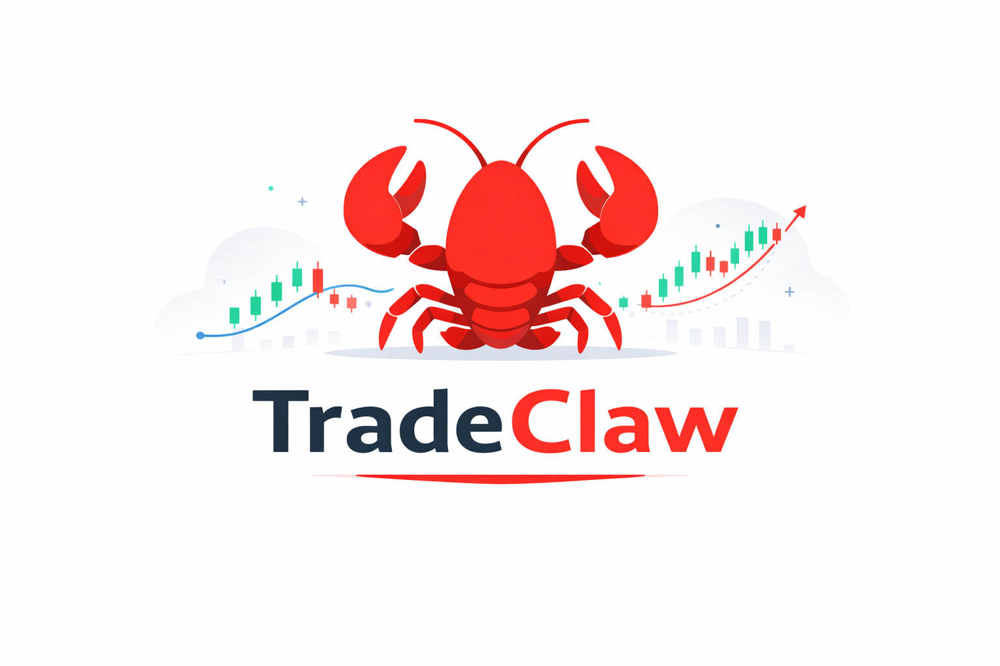

<p align="center">
  
</p>

<h1 align="center">TradeClaw — LLM Agent 交易系统</h1>

<p align="center">
  <a href="license.txt"></a>
</p>

<p align="center">AI 驱动的自主交易系统，支持美股和 ETF 交易。</p>

<p align="center">🇬🇧 <a href="README.md">English</a></p>

## 核心特性

- **LLM 驱动决策** — 使用 LangGraph ReAct Agent，无硬编码规则
- **事件驱动架构** — 异步事件队列，组件完全解耦
- **多 Workflow 支持** — 顺序执行、工具调用、Black-Litterman、认知套利等
- **灵活 LLM 配置** — 多 Provider/模型自由组合，按 Agent 独立配置，YAML 持久化
- **实时监控** — WebSocket 实时行情 + 新闻轮询（AkShare/Alpaca/Tiingo/Finnhub），LLM 评估重要性
- **可配置风险规则** — 止损止盈规则链（YAML），支持硬编码规则与 LLM 分析触发共存
- **浏览器自动化** — Playwright 驱动，支持动态网页抓取和交互
- **代码执行沙箱** — RestrictedPython 安全沙箱（本地）或 OpenSandbox（Docker 隔离）
- **Telegram 控制** — 远程监控和命令执行
- **现代 Web UI** — React + TypeScript + TailwindCSS 响应式前端

## 快速开始（Docker — 推荐）

最快的方式是使用**一键安装脚本**：

```bash
curl -fsSL https://raw.githubusercontent.com/hugging-leg/TradeClaw/main/install.sh | bash
```

脚本会自动：

1. 创建 `tradeclaw/` 目录
2. 下载 `docker-compose.yml`、`env.template` 和 SearXNG 配置
3. 创建 `user_data/` 目录结构
4. 复制 `env.template` → `.env` 供你编辑
5. 通过 `docker compose up -d` 启动所有服务

脚本完成后，编辑 `tradeclaw/.env` 填入你的 API Key，然后访问 **http://localhost:8000**。

### 手动 Docker 部署

```bash
git clone https://github.com/hugging-leg/TradeClaw.git tradeclaw
cd tradeclaw
cp env.template .env
# 编辑 .env 填入 API Key
docker compose up -d
```

### 本地开发

```bash
git clone https://github.com/hugging-leg/TradeClaw.git tradeclaw
cd tradeclaw
pip install -r requirements.txt
# 可选扩展
pip install playwright && playwright install chromium
pip install RestrictedPython

cp env.template .env
# 编辑 .env

# 启动基础设施（Postgres + SearXNG）
docker compose -f docker-compose.dev.yml up -d

# 启动交易系统
python main.py
```

## 配置说明

### `.env` — 核心配置

```bash
cp env.template .env
```

编辑 `.env`：

```bash
# Broker
ALPACA_API_KEY=your_key
ALPACA_SECRET_KEY=your_secret

# 行情数据
TIINGO_API_KEY=your_key

# LLM（兜底配置，推荐使用 Web UI → LLM Providers 管理）
LLM_BASE_URL=https://api.deepseek.com/v1
LLM_API_KEY=your_key
LLM_MODEL=deepseek-chat

# Workflow
WORKFLOW_TYPE=llm_portfolio

# Telegram（可选）
TELEGRAM_BOT_TOKEN=your_token
TELEGRAM_CHAT_ID=your_chat_id
```

### 提供商配置

| 类型 | 环境变量 | 可选值 |
|------|----------|--------|
| Broker | `BROKER_PROVIDER` | `alpaca`, `interactive_brokers` |
| 行情 | `MARKET_DATA_PROVIDER` | `tiingo` |
| 新闻 | `NEWS_PROVIDERS` | `akshare`, `alpaca`, `tiingo`, `finnhub`, `unusual_whales` |
| 实时数据 | `REALTIME_DATA_PROVIDER` | `finnhub`（或留空） |
| 消息 | `MESSAGE_PROVIDER` | `telegram` |

### LLM 配置

LLM 配置通过 `user_data/llm_config.yaml` 管理（也可通过 Web UI → Settings → LLM Providers 配置）：

```yaml
providers:
  - name: deepseek
    base_url: https://api.deepseek.com/v1
    api_key: sk-xxx
    models:
      - name: deepseek-chat
        model_id: deepseek-chat
        description: 主力模型
      - name: deepseek-reasoner
        model_id: deepseek-reasoner
        description: 推理模型

  - name: openai
    base_url: https://api.openai.com/v1
    api_key: sk-xxx
    models:
      - name: gpt4o-mini
        model_id: gpt-4o-mini
        description: 快速便宜

roles:
  agent: deepseek-chat        # 主 Agent 使用的模型
  news_filter: gpt4o-mini     # 新闻过滤使用便宜模型
  memory_summary: gpt4o-mini  # 记忆摘要
```

每个 Agent 也可以在其独立配置中指定 `llm_model` 覆盖默认的 `agent` role。

### 风险管理

风险规则通过 `user_data/risk_rules.yaml` 配置，支持多规则集和 LLM 分析触发：

```yaml
active_rule_set: default
rule_sets:
  - name: default
    description: 系统默认风险规则集
    rules:
      - id: default_stop_loss
        name: 默认止损
        type: stop_loss
        threshold: 5.0       # 5% 止损
        action: close_position
      - id: default_take_profit
        name: 默认止盈
        type: take_profit
        threshold: 15.0      # 15% 止盈
        action: close_position
      - id: concentration_llm
        name: 仓位集中度 LLM 分析
        type: position_concentration
        threshold: 25.0      # 单仓位 > 25% 触发 LLM 分析
        action: trigger_llm_analysis
```

规则动作类型：`close_position`（平仓）、`trigger_llm_analysis`（触发 LLM 分析）、`disable_trading`（禁用交易）

---

## 核心 Workflow 详解

### 1. LLM Portfolio Agent (`llm_portfolio`) — 推荐

完全自主的 AI 投资组合经理，使用 LangGraph ReAct 架构：**Think → Act → Observe → Repeat**。

**决策流程：**

```
触发事件 → 获取组合状态 → 获取市场数据 → 获取新闻
  → LLM 分析 → 决定是否调仓 → 执行交易 → 安排下次分析
```

**工具列表：**

| 工具 | 分类 | 功能 |
|------|------|------|
| `get_portfolio_status` | data | 获取组合状态（总资产、现金、持仓） |
| `get_market_data` | data | 获取市场概况（SPY, QQQ 等指数） |
| `get_latest_news` | data | 获取新闻（支持按股票/行业过滤） |
| `get_latest_price` | data | 获取实时价格 |
| `get_historical_prices` | data | 获取历史 K 线 |
| `check_market_status` | system | 检查市场开盘状态 |
| `adjust_position` | trading | 调整单一持仓到目标比例 |
| `schedule_next_analysis` | system | 安排下次分析时间 |
| `web_search` | web | SearXNG 元搜索引擎搜索 |
| `web_read` | web | 提取网页正文（Trafilatura） |
| `browser_goto` | browser | 浏览器访问动态网页（Playwright） |
| `browser_screenshot` | browser | 截取当前页面截图 |
| `browser_action` | browser | 页面交互（点击、填写、执行 JS） |
| `execute_python` | sandbox | 安全沙箱执行 Python 代码 |

### 2. Black-Litterman Workflow (`black_litterman`)

**量化 + AI 结合** — 基于 Black-Litterman 模型的科学配置：

```
市场均衡收益 (Prior) + LLM 生成的观点 (Views)
  → 贝叶斯更新 → 后验收益预期 → 均值-方差优化 → 最优权重
```

**默认资产池：** `SPY, QQQ, IWM, AAPL, MSFT, GOOGL, NVDA, AMD, META, GLD, TLT, XLF, XLE`

**依赖：** `pip install pyportfolioopt cvxpy`

### 3. Cognitive Arbitrage Workflow (`cognitive_arbitrage`)

**二阶动量策略** — 利用新闻传导时间差套利：

```
直接受益股票 → 已被市场发现，已经涨过了
间接受益股票 → 供应链/竞争/行业联动，反应较慢，存在套利空间
```

核心思想：**买入间接受益评分最高的股票**

### Workflow 对比

| 特性 | LLM Portfolio | Black-Litterman | Cognitive Arbitrage |
|------|---------------|-----------------|---------------------|
| 决策方式 | 完全 LLM 自主 | 量化模型 + LLM 观点 | LLM 分析新闻传导 |
| 数学基础 | 无 | 均值-方差优化 | 评分累积 |
| 适合人群 | 通用 | 量化爱好者 | 事件驱动交易者 |
| 可解释性 | 中 | 高 | 高（传导链可追溯） |
| 资产范围 | 任意 | 固定资产池 | 动态（LLM 识别） |
| 核心优势 | 灵活自主 | 科学配置 | 时间差套利 |

---

## 架构

```
┌──────────────────────────────────────────────────────────────┐
│                        TradingSystem                          │
├──────────────────────────────────────────────────────────────┤
│  SchedulerMixin   MessageManager   RealtimeMonitor           │
│  RiskManager      NewsPolling      QueryHandler              │
│       │                │                 │                   │
│       ▼                ▼                 ▼                   │
│  ┌──────────┐   ┌───────────┐   ┌──────────────────┐        │
│  │ Workflow  │   │ Telegram  │   │  FinnhubRealtime │        │
│  │ Factory   │   │ Service   │   │  + NewsPolling   │        │
│  └────┬─────┘   └───────────┘   └──────────────────┘        │
│       │                                                      │
│       ▼                                                      │
│  ┌──────────────────────────────────────────────────────┐   │
│  │              LLM Agent (LangGraph ReAct)              │   │
│  │  ┌──────────────────────────────────────────────┐    │   │
│  │  │ Tools: data, trading, analysis, system,      │    │   │
│  │  │        web_search, browser, sandbox           │    │   │
│  │  └──────────────────────────────────────────────┘    │   │
│  └──────────────────────────────────────────────────────┘   │
│       │                                                      │
│  ┌────┴─────────────────────────────────────────────┐       │
│  │  Config Layer (YAML)                              │       │
│  │  llm_config.yaml  agents/*.yaml  risk_rules.yaml  │       │
│  └───────────────────────────────────────────────────┘       │
└──────────────────────────────────────────────────────────────┘
                          │
          ┌───────────────┼───────────────┐
          ▼               ▼               ▼
    ┌──────────┐   ┌──────────┐   ┌──────────┐
    │  Broker  │   │  Market  │   │   News   │
    │   API    │   │  Data    │   │   API    │
    └──────────┘   └──────────┘   └──────────┘
```

## Telegram 命令

| 命令 | 说明 |
|------|------|
| `/start` | 启用自动交易 |
| `/stop` | 暂停自动交易 |
| `/status` | 系统状态 |
| `/portfolio` | 组合概览 |
| `/orders` | 活跃订单 |
| `/analyze` | 触发 LLM 分析 |
| `/emergency` | 紧急停止 |

## 扩展开发

### 添加新的 Workflow

```python
from agent_trader.agents.workflow_factory import register_workflow
from agent_trader.agents.workflow_base import WorkflowBase

@register_workflow("my_workflow", description="My custom workflow")
class MyWorkflow(WorkflowBase):
    async def run_workflow(self, initial_context=None):
        # 实现逻辑
        pass
```

### 添加新的适配器

```python
from agent_trader.interfaces.factory import register_broker
from agent_trader.interfaces.broker_api import BrokerAPI

@register_broker("my_broker")
class MyBrokerAdapter(BrokerAPI):
    # 实现接口
    pass
```

## 目录结构

```
tradeclaw/
├── main.py                         # 入口
├── config.py                       # 全局配置 (pydantic-settings)
├── agent_trader/
│   ├── trading_system.py           # 核心系统协调器
│   ├── agents/                     # Workflow 实现
│   │   ├── tools/                  # Agent 工具
│   │   │   ├── data_tools.py       # 数据获取
│   │   │   ├── trading_tools.py    # 交易执行
│   │   │   ├── analysis_tools.py   # 分析工具
│   │   │   ├── web_search_tools.py # SearXNG 搜索
│   │   │   ├── browser_tools.py    # Playwright 浏览器自动化
│   │   │   └── code_sandbox_tools.py # 代码执行沙箱
│   │   ├── workflow_base.py        # Workflow 基类
│   │   └── workflow_factory.py     # Workflow 注册和发现
│   ├── adapters/                   # 适配器
│   │   ├── brokers/                # Broker 适配器 (Alpaca, IBKR)
│   │   ├── market_data/            # 行情适配器 (Tiingo)
│   │   ├── news/                   # 新闻适配器 (AkShare, Alpaca, Tiingo, Finnhub)
│   │   ├── realtime/               # 实时数据适配器 (Finnhub)
│   │   └── transports/             # 消息传输适配器 (Telegram)
│   ├── config/                     # 配置管理
│   │   ├── llm_config.py           # LLM Provider/Model 配置 (YAML)
│   │   ├── agent_config.py         # Agent 独立配置 (YAML)
│   │   └── risk_rules.py           # 风险规则配置 (YAML)
│   ├── interfaces/                 # 抽象接口和工厂
│   ├── services/                   # 服务
│   │   ├── risk_manager.py         # 风险管理
│   │   ├── news_polling.py         # 新闻轮询
│   │   ├── realtime_monitor.py     # 实时监控
│   │   └── scheduler_mixin.py      # APScheduler 混入
│   ├── api/                        # FastAPI 后端
│   ├── models/                     # 数据模型
│   ├── db/                         # 数据库
│   └── utils/                      # 工具函数
├── frontend/                       # React + TypeScript 前端
├── user_data/                      # 数据目录
│   ├── llm_config.yaml             # LLM 配置
│   ├── risk_rules.yaml             # 风险规则
│   └── agents/                     # 各 Workflow 独立配置
├── searxng/                        # SearXNG 配置
├── docker-compose.yml              # 生产部署
├── docker-compose.dev.yml          # 开发基础设施
├── install.sh                      # 一键安装脚本
└── requirements.txt                # Python 依赖
```

## 注意事项

- 默认使用 Paper Trading，生产环境需修改 `ALPACA_BASE_URL`
- 所有时间基于配置的 `TRADING_TIMEZONE`（默认 `US/Eastern`）
- 日志使用 structlog，支持结构化输出和 `correlation_id` 追踪
- 数据持久化在 `user_data/` 目录（数据库、日志、YAML 配置）

## 风险声明

本软件仅供教育和研究用途。交易涉及重大风险，可能导致全部或部分投资损失。过去的表现不代表未来的结果。请从 Paper Trading 开始，并在做出投资决定前咨询持牌财务顾问。

**风险自担。**
