# System Architecture Diagram

## Overview
This diagram illustrates the complete architecture of the AI Trading Agent system, showing the relationships between all components, external APIs, and data flows.

## Architecture Diagram

```mermaid
graph TB
    %% External Services
    subgraph "External APIs"
        ALPACA[Alpaca API<br/>📈 Trading & Portfolio]
        TIINGO[Tiingo API<br/>📊 Market Data & News]
        TELEGRAM[Telegram API<br/>💬 Messaging]
        OPENAI[OpenAI/DeepSeek<br/>🤖 LLM Services]
    end
    
    %% Main System
    subgraph "Trading System Core"
        TS[TradingSystem<br/>🎯 Main Orchestrator]
    end
    
    %% Service Factories
    subgraph "Service Factories"
        BF[BrokerFactory]
        MDF[MarketDataFactory]
        NF[NewsFactory]
        MTF[MessageTransportFactory]
        WF[WorkflowFactory]
    end
    
    %% Adapters
    subgraph "Adapter Layer"
        AA[AlpacaBrokerAdapter<br/>🏦 Trading Interface]
        TMA[TiingoMarketDataAdapter<br/>📈 Market Data]
        TNA[TiingoNewsAdapter<br/>📰 News Feed]
        TGS[TelegramService<br/>📱 Bot Interface]
    end
    
    %% Workflows
    subgraph "AI Workflow Engine"
        WB[WorkflowBase<br/>Abstract]
        SW[SequentialWorkflow<br/>🔄 Fixed Steps]
        TCW[ToolCallingWorkflow<br/>🛠️ Dynamic LLM]
    end
    
    %% Core Components
    subgraph "Core Components"
        ES[EventSystem<br/>⚡ Real-time Events]
        SCH[TradingScheduler<br/>⏰ Task Automation]
        MM[MessageManager<br/>📧 Notification Hub]
    end
    
    %% User Interface
    subgraph "User Interface"
        USER[👤 User]
        TGBOT[📱 Telegram Bot<br/>Remote Control]
    end
    
    %% Data Models
    subgraph "Data Models"
        TM[TradingModels<br/>📋 Data Structures]
    end
    
    %% Utilities
    subgraph "Utilities"
        UTILS[Utils<br/>🔧 Helper Functions]
    end
    
    %% User interactions
    USER --> TGBOT
    TGBOT --> TGS
    
    %% Main system connections
    TS --> BF
    TS --> MDF
    TS --> NF
    TS --> MTF
    TS --> WF
    TS --> ES
    TS --> SCH
    TS --> MM
    
    %% Factory to adapter connections
    BF --> AA
    MDF --> TMA
    NF --> TNA
    MTF --> TGS
    
    %% Workflow factory connections
    WF --> SW
    WF --> TCW
    SW -.-> WB
    TCW -.-> WB
    
    %% Adapter to external API connections
    AA --> ALPACA
    TMA --> TIINGO
    TNA --> TIINGO
    TGS --> TELEGRAM
    
    %% AI connections
    SW --> OPENAI
    TCW --> OPENAI
    
    %% Data flow
    TS --> TM
    MM --> UTILS
    
    %% Event flows
    ES -.-> MM
    SCH -.-> TS
    
    %% Styling
    classDef external fill:#e1f5fe,stroke:#01579b,stroke-width:2px
    classDef factory fill:#f3e5f5,stroke:#4a148c,stroke-width:2px
    classDef adapter fill:#e8f5e8,stroke:#1b5e20,stroke-width:2px
    classDef workflow fill:#fff3e0,stroke:#e65100,stroke-width:2px
    classDef core fill:#ffebee,stroke:#b71c1c,stroke-width:2px
    classDef ui fill:#f1f8e9,stroke:#33691e,stroke-width:2px
    classDef data fill:#fce4ec,stroke:#880e4f,stroke-width:2px
    classDef main fill:#e3f2fd,stroke:#0d47a1,stroke-width:3px
    
    class ALPACA,TIINGO,TELEGRAM,OPENAI external
    class BF,MDF,NF,MTF,WF factory
    class AA,TMA,TNA,TGS adapter
    class WB,SW,TCW workflow
    class ES,SCH,MM core
    class USER,TGBOT ui
    class TM,UTILS data
    class TS main
```

## Component Descriptions

### External APIs
- **Alpaca API**: Provides trading execution and portfolio management
- **Tiingo API**: Market data and financial news source
- **Telegram API**: Real-time messaging and bot interactions
- **OpenAI/DeepSeek**: LLM services for AI decision making

### Service Factories
- **BrokerFactory**: Creates broker adapter instances
- **MarketDataFactory**: Creates market data adapter instances
- **NewsFactory**: Creates news adapter instances
- **MessageTransportFactory**: Creates message transport instances
- **WorkflowFactory**: Creates workflow instances

### Adapter Layer
- **AlpacaBrokerAdapter**: Alpaca-specific trading interface
- **TiingoMarketDataAdapter**: Tiingo market data interface
- **TiingoNewsAdapter**: Tiingo news interface
- **TelegramService**: Telegram bot service

### AI Workflow Engine
- **WorkflowBase**: Abstract base class for all workflows
- **SequentialWorkflow**: Fixed-step workflow implementation
- **ToolCallingWorkflow**: Dynamic LLM-driven workflow

### Core Components
- **EventSystem**: Real-time event processing
- **TradingScheduler**: Automated task scheduling
- **MessageManager**: Centralized notification management

### Data Flow
1. User commands flow through Telegram Bot to TelegramService
2. TradingSystem orchestrates all service factories
3. Factories create appropriate adapter instances
4. Adapters communicate with external APIs
5. Workflows process data and make decisions
6. Events flow through the system for real-time updates
7. Messages and notifications are managed centrally 