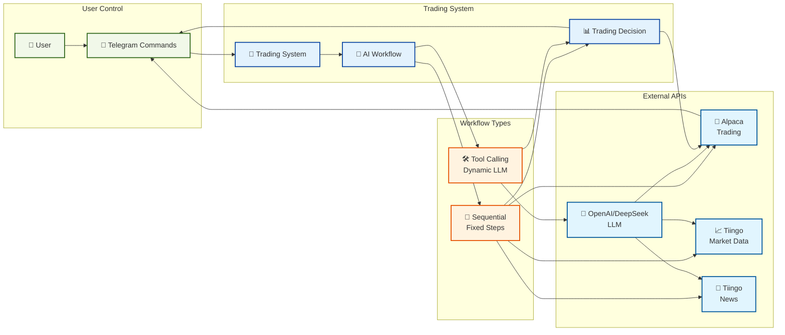

# Trading Workflow Diagram

## Overview
This diagram shows the simplified flow of the AI Trading Agent's main processes.

## Simplified System Flow

## Process Flow Description

### 1. User Interaction
- User sends commands via Telegram Bot
- Commands trigger system operations

### 2. Workflow Selection
- System selects appropriate workflow type:
  - **Sequential**: Fixed 4-step process
  - **Tool Calling**: Dynamic LLM-driven process

### 3. Data Collection
- **Sequential Workflow**: Systematically gathers data from all sources
- **Tool Calling Workflow**: LLM decides which data sources to query

### 4. Decision Making
- Both workflows produce trading decisions
- Decisions are executed through the broker API

### 5. Feedback Loop
- Results are communicated back to user via Telegram
- System maintains real-time status updates

## Workflow Comparison

| Aspect | Sequential Workflow | Tool Calling Workflow |
|--------|-------------------|---------------------|
| **Process** | Fixed 4 steps | Dynamic tool selection |
| **Predictability** | High | Variable |
| **Cost** | Lower | Higher |
| **Flexibility** | Limited | High |
| **Best For** | Routine trading | Complex analysis | 